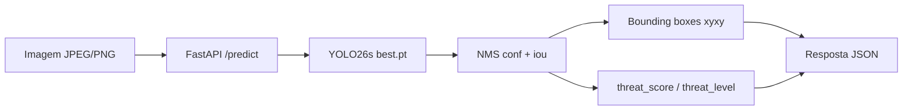

<p align="center">
  
</p>

<h1 align="center">YOLO26 Weapon Threat Detection</h1>

<p align="center">
  <strong>FastAPI · Ultralytics YOLO26s · Roboflow · Docker · Hugging Face Spaces</strong><br />
  <em>API de detecção de ameaças visuais com bounding boxes, score de risco e métricas de treinamento.</em>
</p>

<p align="center">
  <a href="https://github.com/filipecunhaadv/yolo26-weapon-threat-detection"><strong>Ver no GitHub</strong></a>
  &nbsp;·&nbsp;
  <a href="#api-surface">Documentação da API</a>
  &nbsp;·&nbsp;
  <a href="https://universe.roboflow.com/emotion-recognition-mcwg0/weapon-detection-pgqnr-yvlqg-gduy2/dataset/dataset">Dataset Roboflow</a>
</p>

<p align="center">
  
  
  
  
  
  
  
</p>

---

## O que é este projeto

Uma **API REST de detecção de objetos** treinada com **YOLO26s** para identificar sinais visuais de risco em imagens. O modelo classifica três categorias de ameaça e retorna **bounding boxes**, confiança por detecção e um **nível de risco agregado** em JSON.

O pipeline completo — do dataset Roboflow ao deploy no Hugging Face — está documentado no notebook Colab em `notebooks/`.

> **Space ao vivo:** após o deploy, a documentação interativa fica em `/docs` (Swagger UI) e a inferência em `POST /predict`.

<p align="center">
  
</p>

---

## Classes detectadas

| ID | Classe | Descrição | Peso de risco |
|----|--------|-----------|---------------|
| `0` | `gun` | Arma de fogo | 1.00 |
| `1` | `knife` | Faca ou objeto cortante | 0.85 |
| `2` | `person_with_mask` | Pessoa com máscara / balaclava | 0.60 |

O `threat_score` é calculado como `max(confidence × peso_classe)` entre todas as detecções. O `threat_level` segue:

| Nível | Condição |
|-------|----------|
| `none` | Nenhuma detecção |
| `low` | score &lt; 0.45 |
| `medium` | 0.45 ≤ score &lt; 0.75 |
| `high` | score ≥ 0.75 |

---

## Modelo e métricas

| Parâmetro | Valor |
|-----------|-------|
| Arquitetura | YOLO26s (`yolo26s.pt`) |
| Pesos | `model/best.pt` (~19 MB) |
| Épocas | 50 |
| Input size | 640 × 640 |
| Batch | 16 |
| Dataset | [Roboflow — Weapon Detection](https://universe.roboflow.com/emotion-recognition-mcwg0/weapon-detection-pgqnr-yvlqg-gduy2/dataset/dataset) (CC BY 4.0) |

### Resultados finais (época 50)

| Métrica | Valor |
|---------|-------|
| **Precision** | 90.4% |
| **Recall** | 81.8% |
| **mAP@50** | 89.4% |
| **mAP@50-95** | 61.4% |

<p align="center">
  
</p>

<p align="center">
  
  &nbsp;&nbsp;
  
</p>

---

## Fluxo de inferência



A API **não retorna o tensor bruto do YOLO**. Ela serializa o output do Ultralytics (`results[0].boxes`) em JSON estruturado com coordenadas absolutas em pixels.

---

## API Surface

Documentação interativa: **`GET /docs`** · Contrato OpenAPI: **`GET /openapi.json`**

| Área | Endpoint | Descrição |
|------|----------|-----------|
| Sistema | `GET /health` | Status da API e classes carregadas |
| Modelo | `GET /model/info` | Arquitetura, classes, tamanho dos pesos |
| Métricas | `GET /metrics` | Resultados de treino + lista de gráficos |
| Gráficos | `GET /metrics/charts/{nome}` | PNG/JPG de `metrics/` (ex: `results.png`) |
| **Inferência** | `POST /predict` | Detecção YOLO em imagem enviada |

### `POST /predict` — parâmetros

| Query param | Tipo | Padrão | Descrição |
|-------------|------|--------|-----------|
| `conf` | float | `0.25` | Limiar de confiança (0–1) |
| `iou` | float | `0.7` | Limiar IoU para Non-Maximum Suppression |
| `annotated` | bool | `false` | Inclui imagem anotada em base64 |

**Body:** `multipart/form-data` com campo `file` (imagem JPEG ou PNG).

---

## Resposta JSON do YOLO

### Com detecções (`threat_level: high`)

```json
{
  "detections": [
    {
      "class_id": 0,
      "class_name": "gun",
      "confidence": 0.8677,
      "bbox": {
        "x1": 1476.30,
        "y1": 326.82,
        "x2": 1897.84,
        "y2": 517.59
      }
    },
    {
      "class_id": 0,
      "class_name": "gun",
      "confidence": 0.8442,
      "bbox": {
        "x1": 647.19,
        "y1": 591.46,
        "x2": 858.36,
        "y2": 722.60
      }
    }
  ],
  "threat_level": "high",
  "threat_score": 0.8677,
  "image_width": 1920,
  "image_height": 1100,
  "inference_ms": 277.11
}
```

### Sem detecções (`threat_level: none`)

```json
{
  "detections": [],
  "threat_level": "none",
  "threat_score": 0.0,
  "image_width": 1600,
  "image_height": 1600,
  "inference_ms": 177.05
}
```

### Com `annotated=true`

Adiciona o campo `annotated_image_base64` — string JPEG em base64 com bounding boxes desenhadas pelo Ultralytics (`results[0].plot()`).

### Campos da resposta

| Campo | Tipo | Origem YOLO |
|-------|------|-------------|
| `detections[].class_id` | int | `box.cls` |
| `detections[].class_name` | string | `model.names[class_id]` |
| `detections[].confidence` | float | `box.conf` (0–1) |
| `detections[].bbox` | object | `box.xyxy` — canto superior-esquerdo e inferior-direito em **pixels absolutos** |
| `threat_level` | string | Regra de negócio da API |
| `threat_score` | float | `max(conf × peso_classe)` |
| `image_width` / `image_height` | int | Dimensões da imagem de entrada |
| `inference_ms` | float | Tempo total de inferência |

---

## Exemplos de uso

### cURL

```bash
curl -X POST "https://SEU-USUARIO-yolo26-weapon-threat-detection.hf.space/predict?conf=0.25&iou=0.7" \
  -F "file=@imagem.jpg"
```

### Python

```python
import requests

url = "https://SEU-USUARIO-yolo26-weapon-threat-detection.hf.space/predict"
params = {"conf": 0.25, "iou": 0.7, "annotated": True}

with open("imagem.jpg", "rb") as f:
    response = requests.post(url, params=params, files={"file": f})

data = response.json()
for det in data["detections"]:
    print(f"{det['class_name']}: {det['confidence']:.2%} @ {det['bbox']}")
print(f"Risco: {data['threat_level']} ({data['threat_score']})")
```

### JavaScript (fetch)

```javascript
const form = new FormData();
form.append("file", fileInput.files[0]);

const res = await fetch("/predict?conf=0.25&annotated=false", {
  method: "POST",
  body: form,
});
const data = await res.json();
console.log(data.detections, data.threat_level);
```

---

## Estrutura do repositório

```
yolo26-weapon-threat-detection/
├── images/
│   ├── header.svg              # Banner do README
│   └── pipeline.svg            # Diagrama do pipeline
├── app/
│   ├── main.py                 # Rotas FastAPI
│   ├── detector.py             # Inferência YOLO + threat score
│   ├── metrics_loader.py       # Leitura de results.csv
│   └── schemas.py              # Contratos Pydantic / JSON
├── model/
│   └── best.pt                 # Pesos treinados (Git LFS)
├── metrics/                    # Gráficos e resultados do treino
├── notebooks/
│   └── Yolo_weapon_threat_detection_roboflow_ultralytics.ipynb
├── Dockerfile                  # Deploy Hugging Face Spaces
├── requirements.txt
└── app.py                      # Entry point
```

---

## Notebook — pipeline de treinamento

O notebook `notebooks/Yolo_weapon_threat_detection_roboflow_ultralytics.ipynb` cobre:

1. **Download** do dataset Roboflow (formato YOLO26)
2. **Limpeza** de classes irrelevantes (`object`, `0`)
3. **Conversão** de polígonos de segmentação → bounding boxes
4. **Treinamento** YOLO26s — 50 épocas, imgsz 640, batch 16
5. **Validação** e exportação de métricas para `metrics/`

---

## Desenvolvimento local

```bash
git clone https://github.com/filipecunhaadv/yolo26-weapon-threat-detection.git
cd yolo26-weapon-threat-detection

pip install -r requirements.txt
uvicorn app.main:app --reload --port 7860
```

Abra [http://localhost:7860/docs](http://localhost:7860/docs) para testar a inferência interativamente.

### Docker

```bash
docker build -t yolo26-weapon-api .
docker run -p 7860:7860 yolo26-weapon-api
```

---

## Deploy no Hugging Face Spaces

1. Crie um Space com SDK **Docker**
2. Faça push deste repositório (o `model/best.pt` usa **Git LFS**)
3. O Space sobe na porta **7860** automaticamente
4. Acesse `/docs` para Swagger UI e `/predict` para inferência

---

## Disclaimer

Este modelo tem finalidade **educacional e experimental**. Não deve ser usado como sistema de segurança em produção sem validação rigorosa. Detecções podem apresentar falsos positivos e falsos negativos. O uso de imagens de vigilância deve respeitar legislação local de privacidade.

---

## Licença e autor

**[MIT License](LICENSE)**

**Sidnei Alves de Almeida** — desenvolvido como demonstração de pipeline completo de Object Detection com Ultralytics YOLO.
